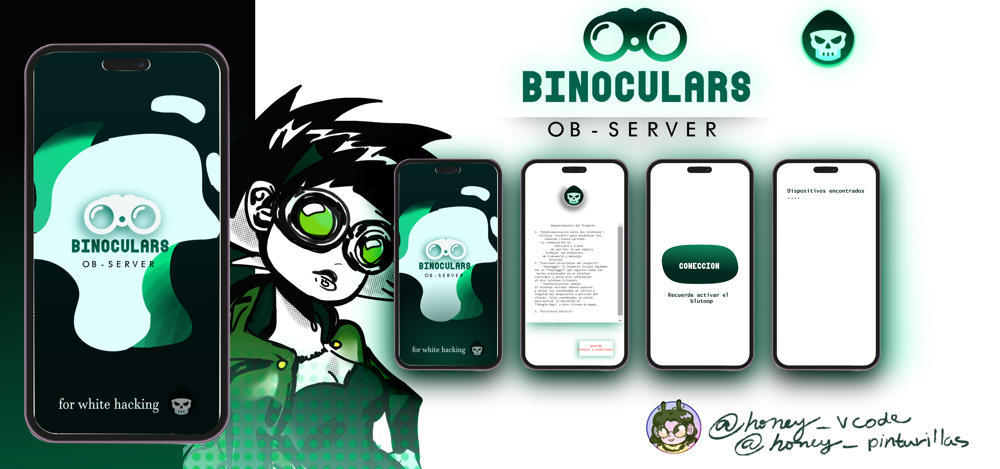

# Binoculars_Observer
Binoculars Ob-Server is an offline, peer-to-peer mobile app for encrypted messaging and covert audio streaming via Bluetooth. It's ideal for privacy-focused and off-grid use, offering secure, server-less communication. The unique "covert listening" feature allows discreet, short-range audio monitoring for specific, ethical purposes
